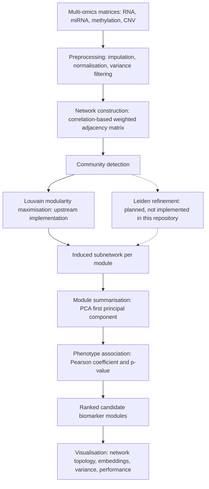

# BioNeuralNet-Leiden

Graph-based multi-omics network analysis with community detection for biomarker discovery.

> **Status and attribution.** This repository holds a partial working copy of the open-source **BioNeuralNet** library, kept here as the substrate for an intended **Leiden** community-detection extension. The code under `bioneuralnet/` is upstream code and is not original work. The Leiden extension implied by the repository name is not yet implemented here - see the Status section below.

## Scope

Multi-omics biomarker discovery can be posed as a graph problem. Features such as transcripts, CpG sites, miRNAs and copy-number segments become nodes; a correlation or partial-correlation criterion induces weighted edges; biologically coherent modules then appear as densely connected communities. Ranking those communities by their association with a clinical phenotype yields candidate biomarker panels that are interpretable at the module level rather than the single-feature level.

The distinction that motivates this repository is between **Louvain** and **Leiden** partitioning. Louvain maximises modularity greedily and can return internally disconnected communities. Leiden adds a refinement phase that guarantees every community is internally connected and converges towards a partition in which no node is locally misassigned. That property matters here because the downstream steps summarise each module by its first principal component, which is only meaningful if the module is genuinely one connected structure.

## Pipeline

Solid arrows correspond to code that exists, either in this repository or in the upstream package. The dashed path is the intended contribution and does not exist yet.

## Repository contents

| Path | Contents |
| --- | --- |
| `bioneuralnet/metrics/correlation.py` | `omics_correlation`, `cluster_correlation`, `louvain_to_adjacency` |
| `bioneuralnet/metrics/plot.py` | plotting helpers for network topology, embeddings, variance and performance metrics |
| `bioneuralnet/datasets/kipan/rna.csv` | KIPAN RNA expression matrix, the worked example for the pipeline above |
| `assets/` | figures carried over from the upstream documentation |
| `CHANGELOG.md` | upstream changelog, currently at version 1.2.1 |

## Implemented functions

`omics_correlation(omics, pheno)` standardises the omics matrix with a z-score scaler, projects it onto its first principal component and returns the Pearson coefficient and p-value of that component against the phenotype vector. Empty inputs and mismatched sample counts raise a ValueError.

`cluster_correlation(cluster_df, pheno)` applies the same PC1 summarisation to a single module. Modules with fewer than two features or zero total variance are skipped, the component and the phenotype are inner-joined on the sample index, and fewer than three overlapping samples aborts the test rather than returning an unstable coefficient.

`louvain_to_adjacency(louvain_cluster)` converts an induced subnetwork into a Pearson adjacency matrix with a zeroed diagonal and missing values coerced to zero, ready for re-clustering or export.

`bioneuralnet/metrics/plot.py` exposes `plot_network`, `plot_embeddings`, `compare_clusters`, `plot_variance_distribution`, `plot_variance_by_feature`, `plot_performance`, `plot_performance_three` and `plot_multiple_metrics`.

## Status

This is a work in progress and is not installable as it stands. Three points are worth stating plainly. First, no Leiden implementation is present: a search of the tree returns no occurrence of the term, and the only partitioning helper is the Louvain one listed above. Second, the vendored copy is partial, so `correlation.py` imports `bioneuralnet.utils.logger`, which is absent from this tree, and the module therefore fails to import without the full upstream package installed. Third, there is no packaging metadata, test suite or licence file.

## Roadmap

1. Depend on the published BioNeuralNet package rather than vendoring part of it, or mark this repository as a fork so that provenance is visible from the repository header.
2. Implement a Leiden partition backend on `leidenalg` and `python-igraph`, exposing resolution, objective function and iteration count, with a `leiden_to_adjacency` counterpart to the existing Louvain helper.
3. Benchmark Leiden against Louvain on the KIPAN matrix: modularity, community count, the fraction of internally connected communities, and phenotype association strength per module.
4. Add packaging metadata, unit tests and continuous integration.
5. Add a licence file consistent with the upstream terms.

## Related repositories

[Multivariable-Modelling-Reveals-EGFR-Copy-Number-as-an-Independent-Predictor-of-Survival-in-LUAD](https://github.com/datascintist-abusufian/Multivariable-Modelling-Reveals-EGFR-Copy-Number-as-an-Independent-Predictor-of-Survival-in-LUAD) applies survival modelling to the same class of molecular data. [Survival-Analysis](https://github.com/datascintist-abusufian/Survival-Analysis) covers the prognostic modelling side.

## Licence

No licence file is present in this repository. The vendored code remains subject to the upstream BioNeuralNet licence, which should be checked before redistributing or reusing it.

## Author

Md Abu Sufian - ORCID [0009-0007-3503-6942](https://orcid.org/0009-0007-3503-6942)
